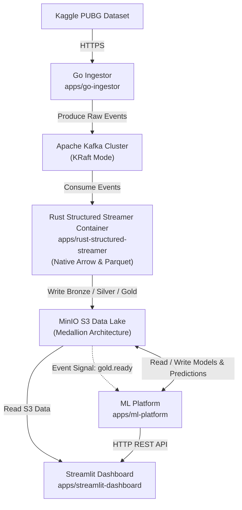

# PUBG Anti-Cheat Data Platform — System Architecture (ARCH)

Tài liệu mô tả tổng quan kiến trúc cấp cao (High-Level Topology) và danh sách routing tới tài liệu chi tiết của từng sub-project trong monorepo.

---

## 1. 🏗️ High-Level System Topology



---

## 2. 🧩 Danh Sách Các Sub-Projects (Sub-Project Registry)

| Sub-Project | Công Nghệ | Vai Trò Tổng Quan | Tài Liệu Chi Tiết |
|:---|:---|:---|:---|
| **Go Ingestor** | Go 1.26 | Download dataset, chuẩn hóa & stream dữ liệu vào Kafka | [apps/go-ingestor/README.md](apps/go-ingestor/README.md) |
| **Rust Structured Streamer** | Rust 1.88 | Stream processing, 2PC write Parquet vào MinIO, Native Async Tokio Worker Pool | [apps/rust-structured-streamer/README.md](apps/rust-structured-streamer/README.md) |
| **ML Platform** | Python 3.13, Rust 1.88, Go 1.26 | Huấn luyện mô hình, suy luận ONNX & REST API Gateway | [apps/ml-platform/README.md](apps/ml-platform/README.md) |
| **Streamlit Dashboard** | Python 3.13 / Streamlit | Giao diện Web UI phân tích rủi ro & bằng chứng gian lận | Sub-project frontend (`apps/streamlit-dashboard`) |

---

## 3. 📡 Kafka Topic Registry

| # | Topic Name | Partitions | Retention | Producer | Consumer | Vai Trò |
|:-:|:---|:-:|:-:|:---|:---|:---|
| 1 | `pubg.v1.player-stat.raw` | 3 | 7 ngày | Go Ingestor | Rust Structured Streamer | Event Stream thô từ Kaggle |
| 2 | `pubg.v1.invalid` | 1 | 30 ngày | Go Ingestor | Audit / Debug | Dead-Letter Queue (DLQ) |
| 3 | `pubg.v1.dataset.gold.ready` | — | — | Rust Structured Streamer | ML Platform | Tín hiệu Gold data sẵn sàng |
| 4 | `pubg.v1.ml.model.ready` | — | — | ML Platform | ML Platform | Tín hiệu ONNX model xuất bản |

---

## 4. 🗄️ MinIO Data Lake Layout (Medallion Pattern)

```text
fps-anticheat-datalake/                     pubg-models/
├── bronze/ (Raw Parquet & Invalid Logs)    └── v1/model.onnx
├── manifests/ (2PC Audit Manifests)
├── silver/ (Cleaned Players, Matches)      pubg-predictions/
└── gold/ (Player Match Features)           └── model_version=v1/predictions.parquet
```

> 📖 **Chi tiết quy chuẩn S3**: [docs/DATA_LAKE_LAYOUT.md](docs/DATA_LAKE_LAYOUT.md)

---

## 5. 🐳 Deployment Topology

```text
docker-compose.yml
├── kafka                     (Kafka Broker KRaft Mode, Port 9092)
├── kafka-ui                  (Kafka UI Web Dashboard, Port 8080)
├── minio                     (MinIO S3 Storage, Ports 9000+9001)
├── init-kafka                (Tạo Kafka Topics)
├── init-minio                (Tạo MinIO Buckets)
├── rust-structured-streamer  (Rust Structured Streamer Container)
├── python-ml-worker          (ML Training Service)
└── streamlit-dashboard       (Streamlit Analytics UI, Port 8501)
```
